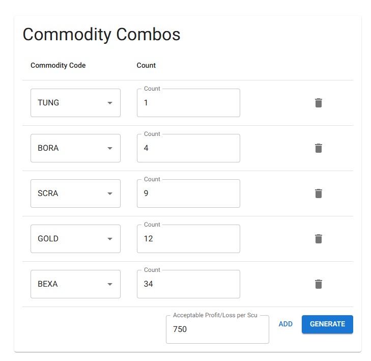
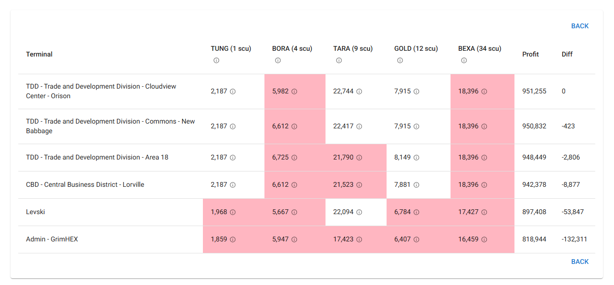
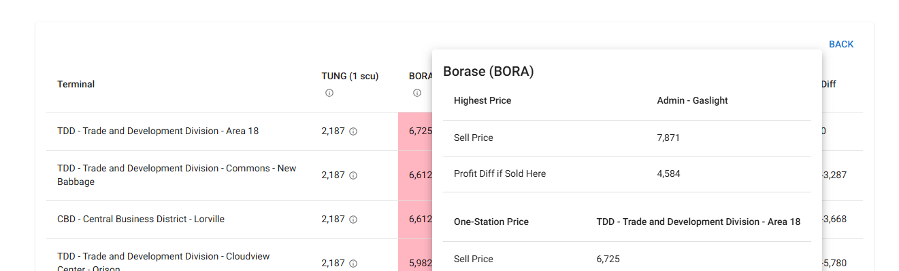
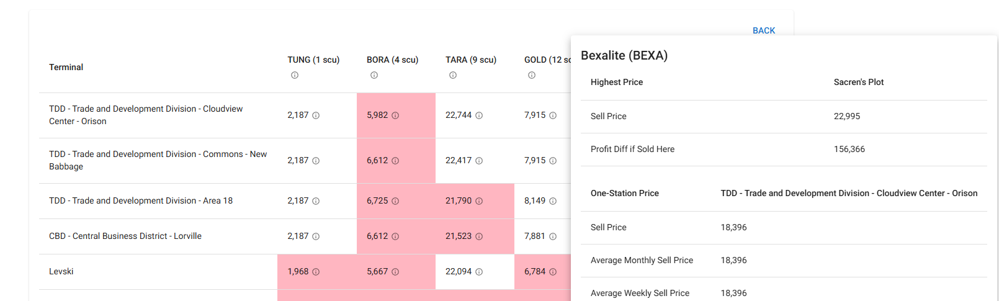

# Combo

Combo is a web application tool for the game Star Citizen. It uses publicly generated data from https://uexcorp.space/ to determine the best single station to take a collection of cargo. Useful for lazy captains who have 6 commodities and only want to fly to one station to sell them all, it is useful in mining and when collecting cargo from salvaged ships.

You may use Combo on the Vercel Platform at https://combo-raely42.vercel.app/

Add your cargo and amounts to the table. If you choose, you may adjust how much profit-loss you are ok with before generating the summary.


The app gathers data on all your cargo, calculates the profit for any station that will buy all of it, and then sorts the table so that the best price for you is at the top. Any commodities that would sell at a worse profit-loss than your acceptable value are marked in red. Click on the (i) to see details.


Borase is marked as outside the acceptable profit loss, so we click on the (i) and knowing that we only have 4 units of it, the loss of 4,584 credits is fine.


Bexalite is also marked as outside our acceptable loss, but here we have 34 units and so the loss is much greater overall. We can choose to take it to Gaslight station instead to gain an additional 156,366 credits if we want.


## Technical

Combo is written in node.js using the Next.js framework for server and client side React rendering. It calls the UEX public API to gather data that has been publically crowdsourced and made available to developers.

### Development

You will need to create a .env file and fill in the value for UEX_KEY, which you can get by registering at https://uexcorp.space/ for an API key.

You can start the development server using

```bash
npm run dev
# or
yarn dev
# or
pnpm dev
# or
bun dev
```

Open [http://localhost:3000](http://localhost:3000) with your browser to see the result.

# Technical Todo
- use API to generate list of commodities for InputTable.jsx, rather than hard-coding
- ability to sort output table
- check mobile experience
- use browser locale instead of hard-coding en-US
- make output table able to better support 6 entries, looks weird
- consider caching data so we aren't pulling constantly


